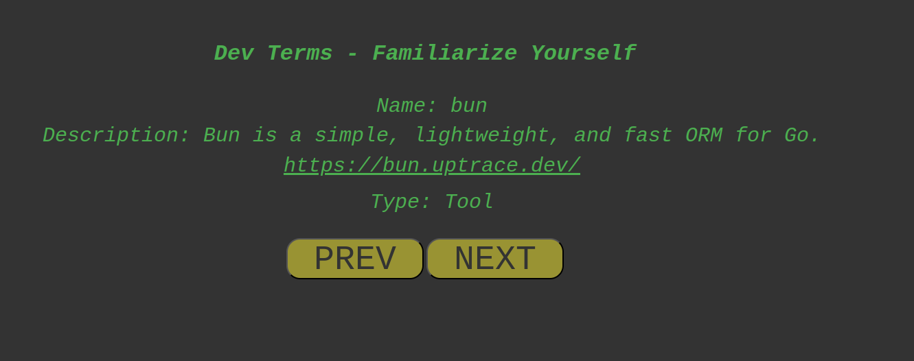

  
<a href="screenshots/devTerms_screenshot01.png">;

# Review Your Dev Terms 

For beginners or advanced programmers, a little repository showing info about various development terms.
<ol>
  <li>name</li>
  <li>description</li>
  <li>functional link to info source</li>
  <li>category (e.g., tool, framekwork, language, etc.)</li> 
</ol>
